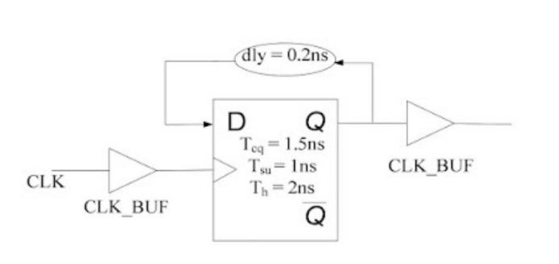

# INTERVIEW QUESTIONS

## MOSFET & Device Physics Questions

- Draw and explain ID−VDS and ID−VGS curves, highlighting the Cut-off, Linear, and Saturation regions.

- Explain the physical cause and effect of Channel Length Modulation (CLM), DIBL (Drain-Induced Barrier Lowering), and Velocity Saturation on ID.

- How does technology scaling lead to Short Channel Effects (SCE)?

- Derive the MOSFET small signal model and explain C-V characteristics (Gate capacitance behavior).

- Why is MOSFET preferred for VLSI? Explain the difference between Enhancement and Depletion modes.

---

## CMOS & Logic Design Questions

- Draw the CMOS Inverter VTC (Voltage Transfer Characteristics) and explain why PMOS and NMOS require different sizing (W/L ratio).

- Design NAND and XOR gates using only CMOS transistors; realize any basic gate using only MUX.

- Compare Static CMOS vs. Pass Transistor Logic (PTL) in terms of power, speed, and voltage swing.

- How do you size NMOS and PMOS transistors to increase the threshold voltage?

- What is Noise Margin and how do you determine it?

- Draw and size a two-input NAND gate considering Vth and equal rise/fall times.

- In a NAND gate, which NMOS input to place near the output for optimizing delay?

---

## Static Timing Analysis (STA)

- Define Setup and Hold times, their equations, and explain how to fix violations.

- Analyze the effect of Clock Skew, Jitter, and Propagation Delay on the maximum clock frequency (Fmax).

- Consider the circuit diagram and the timing requirement as shown for the flip flop. Two clock buffers are added at the clock pin and the output pin. Also a combination delay of dly = 0.2ns in the input to the output path.



Check for any violation in the circuit with the given timing requirements, and if there is any violation then what would be the updated value of dly? Also is there any effect on fmaximum due to added clock buffers.

### Solution

#### STA Problem Solution

1. Let us check for the hold violation in the circuit. We know the constraint to be checked that is,

```text
Thold_time <= Tclock_Q + delay
2ns <= 1.5ns + 0.2ns
2ns <= 1.7ns
```

Since the condition fails we can say there is a hold time violation in the circuit.

2. To remove the above hold violation we can vary the dly to

```text
Thold_time <= Tclock_Q + delay
dly >= Thold_time - Tclock_Q
dly >= 2ns - 1.5ns
dly >= 0.5ns
```

The dly must be greater than or equals to 0.5ns to avoid hold violation in the above circuit.

3. The clock buffer delays do not affect the fmaximum of the circuit.

---

# 4. Digital Electronics & FSM

- Compare Latch vs. Flip-Flop (transparency vs. edge-triggering) and explain Metastability in synchronizers.

- Contrast Mealy vs. Moore models; design a sequence detector or a synchronous counter for a specific sequence.

- Design a "Divide by N" circuit (specifically for odd and even N).

---

## Circuit Theory & Transients

- Draw Vout and current waveforms for RC/RL circuits under Step and Pulse inputs without using Laplace transforms.

- RC circuits, Node analysis, RLC circuit based numericals.

- Analyze 2-capacitor circuits (e.g., what happens when a charged capacitor is shorted to an uncharged one).

- Solve for voltage/current in this complex circuit using Norton/Thevenin or Delta-Star conversion.

---

# 6. Op-Amps & Analog Design

- Identify Positive vs. Negative feedback loops and explain why Op-amp output is limited to VDD/VSS.

- Explain the limitations of Virtual Ground and Virtual Short assumptions.

- Design Op-Amp as a Summer, Integrator, or Differentiator and draw the corresponding capacitor waveforms.

- Calculate Gain, Rin, Rout for Common Source (CS), Common Gate (CG), and Common Drain (CD) amplifiers.

---

# 7. Filters & Frequency Response

- Draw and compare the Step, Pulse, and Impulse responses for LPF and HPF.

- Explain why a High Pass Filter shows negative spikes when a square wave is applied.

- Define Gain/Phase Margin and Gain Crossover Frequency; explain the Barkhausen Stability Criterion for oscillators.

- Design an active LPF/HPF for a specific cutoff frequency using Op-Amps.

---

# 8. Verilog & HDL

- Explain the difference between Blocking (=) and Non-blocking (<=) assignments and when to use each to avoid Race Conditions.

- Difference between reg and wire and their hardware synthesis.

- Write Verilog code for a basic FSM, Shift Register, or Counter.

---

# 9. Computer Architecture

- Identify and resolve Data, Control, and Structural hazards in a pipeline.

- Calculate Cache Hit Ratio and average access time; explain the trade-offs in memory organization (SRAM vs. DRAM).

---

# 10. Design Flow & DFT

- List the stages of the VLSI design flow and the deliverables at each stage (Netlist, GDSII, etc.).

- Explain Scan Chain design, Stuck-at faults, and BIST (Built-In Self Test) basics.
